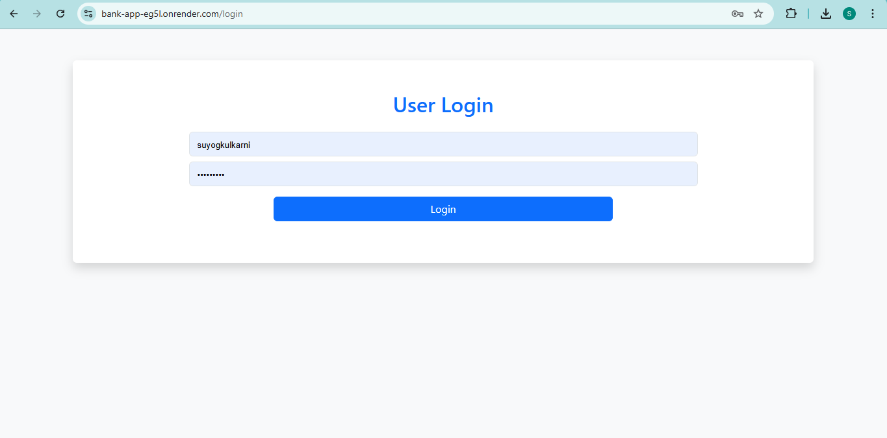
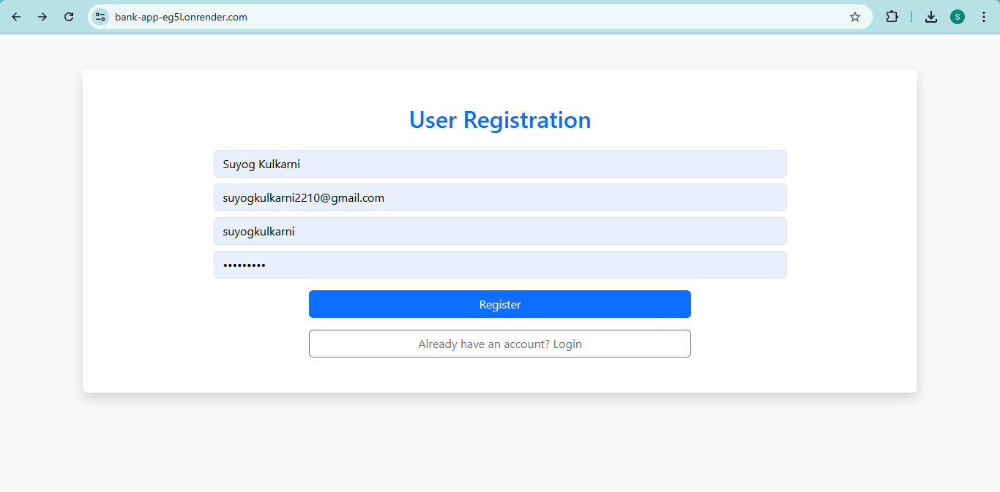
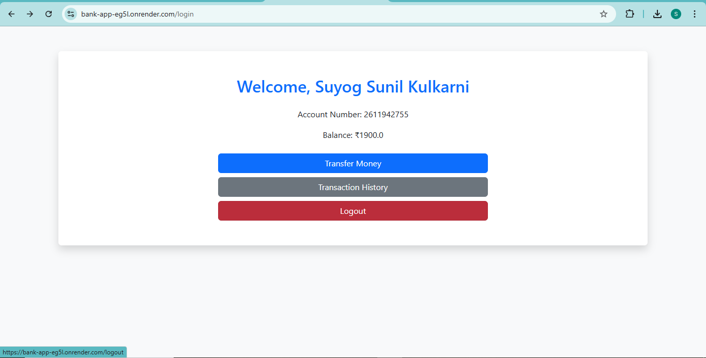
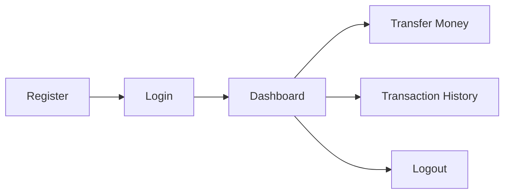

# 🏦 Banking Web Application – Spring Boot

<p align="center">
  
  
  
  
  
  
</p>

<p align="center">
  💻 Full-Stack Banking System with Secure Login, Money Transfer & Transaction Tracking  
</p>

---

# 🚀 Live Demo

🔗 **Click here to use the application:**
👉 **[https://bank-app-eg5l.onrender.com/](https://bank-app-eg5l.onrender.com/)**

---

# 📸 Application Screens

## 🔐 Login Page



## 📝 User Registration




## 📊 Dashboard



## 📜 Transaction History


---

# ✨ Features

### 👤 Authentication

* User Registration & Login
* Session-based authentication
* BCrypt-ready password encryption

### 📊 Dashboard

* Displays:

  * 👤 User Name
  * 🏦 Account Number
  * 💰 Current Balance
* Navigation to core banking features

### 💸 Money Transfer

* Transfer money between accounts
* Validations:

  * ✅ Sufficient balance
  * ✅ Receiver account exists
  * ❌ Prevent self-transfer

### 📜 Transaction History

* View **Debit / Credit** transactions
* Shows:

  * Sender & Receiver
  * Amount
  * Date & Time (`dd/MM/yyyy hh:mm a`)

### 🚪 Logout

* Secure session handling

---

# 🛠️ Tech Stack

| Layer           | Technology                                    |
| --------------- | --------------------------------------------- |
| Backend         | Java, Spring Boot, Spring Data JPA, Hibernate |
| Frontend        | Thymeleaf, HTML, CSS, Bootstrap               |
| Database        | MySQL / H2                                    |
| Build Tool      | Maven                                         |
| Version Control | Git & GitHub                                  |
| Deployment      | Render                                        |

---

# 📂 Project Structure

```
banking-app/
│
├─ controller/        # MVC Controllers
├─ entity/            # JPA Entities (User, Account, Transaction)
├─ repository/        # Spring Data JPA Repositories
├─ config/            # Security / Password Encoder
│
├─ templates/         # Thymeleaf Views
├─ application.properties
└─ pom.xml
```

---

# ⚙️ How to Run Locally

### 1️⃣ Clone Repository

```bash
git clone https://github.com/suyogkulkarni2210/banking-app.git
cd banking-app
```

### 2️⃣ Build Project

```bash
mvn clean install
```

### 3️⃣ Run Application

```bash
mvn spring-boot:run
```

### 4️⃣ Open in Browser

```
http://localhost:8080/
```

---

# 🔄 Application Flow



---

# ✅ Validations Implemented

* Empty field validation
* Invalid login handling
* Insufficient balance protection
* Account existence verification

---

# 🔮 Future Enhancements

* 🔐 Spring Security (role-based authentication)
* 📱 REST APIs for mobile apps
* 🔎 Transaction filters (date / amount / type)
* 🧑‍💼 Admin dashboard
* 📧 Email notifications

---

# 👨‍💻 Author

**Suyog Kulkarni**

📧 [suyogkulkarni2210@gmail.com](mailto:suyogkulkarni2210@gmail.com)
🔗 GitHub: [https://github.com/suyogkulkarni2210](https://github.com/suyogkulkarni2210)
🔗 LinkedIn: [https://www.linkedin.com/in/suyog-kulkarni-048011246](https://www.linkedin.com/in/suyog-kulkarni-048011246)

---

# ⭐ Show Your Support

If you like this project:

🌟 Star the repo
🍴 Fork it
📢 Share it

---
